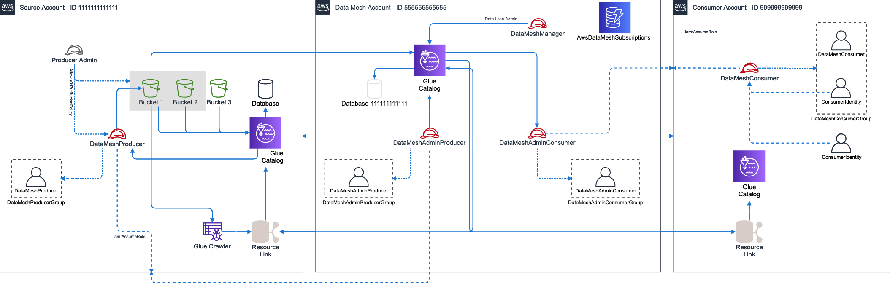

# AWS Data Mesh Helper Library

The AWS Data Mesh Helper library provides automation around the most common tasks that customers need to perform to implement
a data mesh architecture on AWS. A data mesh on AWS uses a central AWS Account (the mesh account) to store the metadata
associated with __Data Products__ created by data __Producers__. This allows other AWS Accounts to act as __Consumers__, and to
request __Subscriptions__, which must be approved by __Producers__. Upon approval, the approved grants are provided to the __Consumer__
and can be used within their AWS Account.

### Definition of Terms

* __Data Mesh__ - An architectural pattern which provides a centralised environment in which the data sharing contract is managed. Data stays within __Producer__ AWS Accounts, and they own the lifecycle of granting __Subscriptions__.
* __Producer__ - Any entity which offers a __Data Product__ through the __Data Mesh__
* __Consumer__ - Any entity who subscribes to a __Data Product__ in the __Data Mesh__
* __Subscription__ - The central record and associated AWS Lake Formation permissions linking a __Data Product__ to a __Consumer__
* __Data Product__ - Today, a __Data Product__ is scoped to be only an AWS Lake Formation Table or Database. In future this definition may expand.

### The Workflow

To get started, you must first enable an AWS Account as the __Data Mesh__ Account. This is where you will store all Lake Formation
metadata about the __Data Products__ which are offered to __Consumers__. Within this Account, there exist IAM Roles for __Producer__ and __Consumer__ 
which allow any AWS Identity who has access to perform tasks within the Data Mesh.

Once you have setup an Account as the __Data Mesh__, you can then activate another AWS Account as a __Producer__, __Consumer__, or both. All
of these tasks are performed by the __Data Mesh Admin__, which is accessible through an additional IAM Role or as any Administrator
Identity within the mesh Account. Once completed, end users can perform the following Data Mesh tasks:

### Data Mesh Tasks

* __Create Data Product__ (__Producer__) - Exposes a Lake Formation Database and/or one-or-more Tables as __Data Products__
* __Subscribe to Data Product__ (__Consumer__) - Creates a record of a request for specific permissions on a __Data Product__ for a __Consumer__
* __Approve Subscription Request__ (__Producer__) - Allows for a __Producer__ to approve a set of permissions against a __Data Product__
* __Delete Subscription__ (__Any__) - Allows a __Consumer__ or __Producer__ to delete a __Subscription__ request. Can be used at any time. Please note the __Subscription__ is not deleted, but instead is archived.
* __Modify Subscription__ (__Producer__) - Allows a __Producer__ to expand or reduce the scope of a __Consumer's__ access to a __Data Product__
* __List Subscriptions__ (__Any__) - Lists all __Subscriptions__ and their associated status for any number of filters
* __Get Subscription__ (__Any__) - Retrieves a single __Subscription__

### Overall System Architecture

The following diagram depicts the overall system architecture associated with a Data Mesh that is in use by a single __Producer__ and __Consumer__:

In this architecture, we can see that the data mesh is configured in AWS Account 555555555555, and contains a set of IAM Roles which allow identities within producer and consumer accounts to access the mesh. This includes:

* `DataMeshManager` - IAM Role allowing administration of the Data Mesh itself
* `DataMeshAdminProducer` - IAM Role enabling the assuming Identity to act as a __Producer__
* `DataMeshAdminConsumer` - IAM Role enabling the assuming Identity to act as a __Consumer__

For testing and simplicity, every IAM Role in the solution is accompanied by a single IAM User who is a member of a Group specific to the function. This will enable you to add users to this Group should you wish to, rather than using a programmatic approach. IAM Roles are backed by an IAM Policy of the same name as the Role, and all objects in the IAM stack for AWS Data Mesh reside at path _/AwsDataMesh/_.

You can then see that there is a Producer Account 111111111111 who has been abled to act as a __Producer__. Within this account we see a similar approach to IAM principals, with the creation of a `DataMeshProducer` IAM Role which is accompanied by an associated user and group. When configured, the `DataMeshProducer` role is granted rights to assume the `DataMeshAdminProducer` role in the data mesh Account.

Similarly, we have a consumer Account 999999999999. This Account also includes IAM objects to enable data mesh access, including the `DataMeshConsumer` IAM Role, and associated IAM users and groups. Only the `DataMeshConsumer` role may assume the `DataMeshAdminConsumer` role in the data mesh Account.

All information around current or pending subscriptions is stored in DynamoDB, in table `AwsDataMeshSubscriptions`. This table is secured for only those operations which __Producers__ or __Consumer__ roles are allowed to execute, and stores the overall lifecycle for __Subscriptions__.

### Library Structure

This functionality is presented to customers as a Python library to allow maximum re-use. It is divided into 3 modules, each specific to a persona within the overall Data Mesh architecture:

* `src`
	* `data_mesh_util`
		* [`DataMeshAdmin.py`](doc/DataMeshAdmin.md) - Includes functionality to be performed by the Administrative function, and is generally only used once to setup the Mesh architecture
		* [`DataMeshProducer.py`](doc/DataMeshProducer.md) - Includes functionality performed by the __Producer__ persona, to create an manage __Data Products__
		* [`DataMeshConsumer.py`](doc/DataMeshConsumer.md) - Includes functionality allowing principals to subscribe to __Data Products__
	* `lib`
		* `constants.py` - Contains contant values used in user or class interaction
		* `SubscriberTracker.py` - Class that manages data product __Subscription__ status
		* `ApiAutomator.py` - Helper class that automates API requests against AWS Accounts
		* `utils.py` - Various utility functions shared across the codebase
	* `resource` - Pystache templates used to generate IAM policies
* `test` - Integration tests of functionality

---
Amazon Web Services, 2021
All rights reserved.